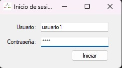
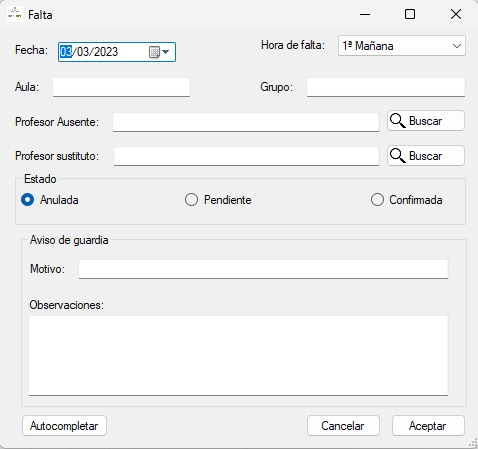
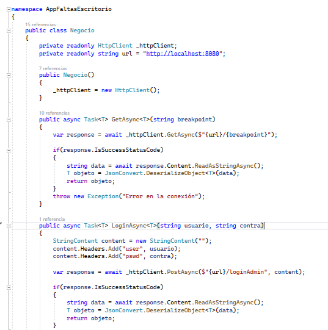
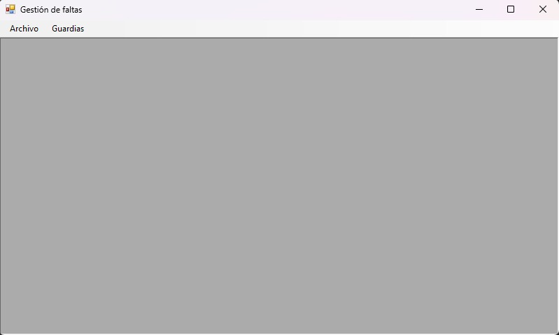
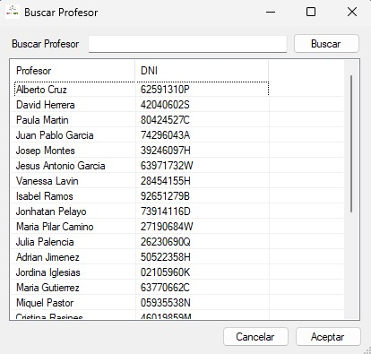
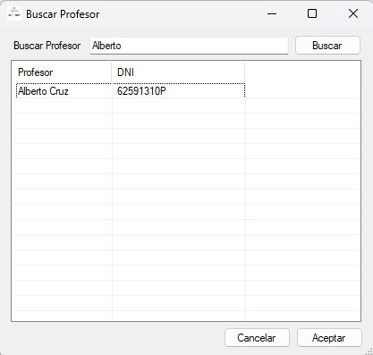
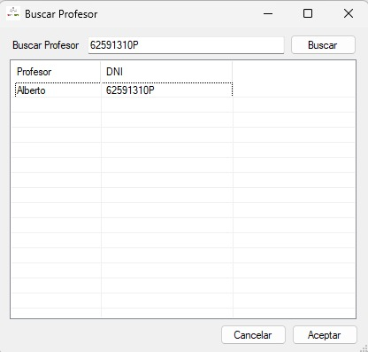

# PROYECTO DE GESTIÓN DE GUARDIAS: APLICACION DE ESCRITORIO

## Grupo 1: Adrian, Diego, Sergio y Aarón S.

___

### INDICE

1. [INTRODUCCIÓN](#introducción)
2. [FUNCIONAMIENTO](#funcionamiento)
    * [Interacción con la API](#Interaccion)
3. [CLASES](#clases)
4. [FORMULARIOS DE LA APLICACION](#FORMULARIOS)
    * [Login](#login)
    * [Formulario Principal](#formulario_principal)
    * [Mantenimiento de guardias](#listaFaltas)
    * [Formulario de guardias](#faltas_form)

### INTRODUCCIÓN
  

El objetivo de la aplicación de escritorio del proyecto es permitir a los administradores del centro, ya sea un profesor administrador o jefatura de estudios, manejar las guardias y faltas del profesorado, mantener un registro actualizado de las mismas, y modificar los datos existentes si fuera necesario. A su vez, el profesorado cuenta con una aplicación movil con la que administrar y crear sus propias faltas y cubrir las guardias de sus compañeros.

___

### FUNCIONAMIENTO

La aplicación de escritorio funciona conectada a una API Rest que almacena sus datos en un servidor externo. A su vez, la aplicación de móvil de los profesores se conecta a la misma API.

La aplicación de escritorio está restringida a usuarios administradores, por lo que un formulario de login comprueba que las credenciales correspondan a un administrador, y da paso a un formulario de administración de guardias.

Este formulario, alojado en un formulario mdi padre, muestra todas las guardias o faltas registradas en la base de datos, . El listado cuenta con un menú contextual que nos permite Crear, Ver y Borrar Guardias para administrarlas.

El formulario de guardias permite crear y editar guardias, así como, opcionalmente, crear avisos de las mismas. Este formulario emplea a su vez un formulario de busqueda de profesores.

#### **Interacción con la API**

La aplicación de escritorio usa una serie de funciones asincronas en su clase Negocio para manejar la interacción con la API. Hay funciones obtención(GET), creación(POST), actualización(PUT) y borrado(DELETE) de datos genericas que toman como argumento la clase a utilizar, así como metodos más concretos para el login y función de autocompletado del formulario de guardias. A su vez, una clase estática Herramientas recoge metodos utilizando Negocio para tareas concretas, tales como obtener las guardias para el listado.

Aparte de los metodos genéricos de la API, métodos de autocompletar y login de administrador han sido creados en la misma para la aplicación de escritorio.

___

### CLASES

La aplicación de escritorio utiliza como modelo las clases usadas en la base de datos, replicando en nombres y nomenclatura lo utilizado en esta para evitar posibles conflictos con la misma. Además del modelo y los formularios, que son explicados más adelante, el programa cuenta con la clase Negocio, que maneja el uso de datos y la interacción con la API, Herramientas, una clase estática con métodos para manejar datos de la API usando los genéricos de Negocio. Los metodos de Negocio son genericos que piden como argumento la url de la tabla a buscar, a la que debe añadir el id indicado en casod e necesitarlo. Para las funciones que lo requieren, pide a su vez una apikey, que viene asociada al administrador utilizando la aplicación al momento. Además, el programa cuentas con una clase GuardiaSorter, que utiliza la interfar IComparer para ordenar correctamente la lista de guardias del formulario de mantenimiento.

En orden de proporcionar una apikey funcional a todos los usuarios, hemos creado un campo apikey en la base de datos y todas las clases correspondientes en la API y las aplicaciones. Este campo permite a su vez, a futuro, llevar un registro de los inicios de sesión de la aplicacion a futuro si así se quisiera.

___

### FORMULARIOS DE LA APLICACIÓN

La aplicación de escritorio se compone de 5 formularios, siendo uno de estos un formulario mdi padre que a futuro podrá albergar el mantenimiento de profesores u horarios. Todos estos comparten una variable profesor "admin" con el administrador actual, dando así acceso a la apikey del mismo. 

#### **Formulario Login**

El primer formulario mostrado es un formulario de inicio de sesión, que pide al usuario un nombre de usuario y contraseña. Al iniciar sesión, el programa encripta la contraseña con un HASH md5 y envía ambos datos a la API, que comprueba si el usuario existe en la base de datos, y si es considerado un administrador. En caso de un error, de un usuario inexistente o no valido, o de contraseña incorrecta, el programa muestra el mensaje correspondiente.

#### **Formulario principal**

El formulario principal es un padre mdi sencillo pensado para albergar los diferentes formularios de gestión de la aplicación. Actualmente, el unico formulario disponible es el listado de guardias, al que se accede con el menú de la parte superior. El objeto archivo del menú da una opción para cerrar correctamente toda la aplicación.

#### **Mantenimiento de guardias**

El formulario de gestión de guardias muestra todas las guardias o faltas registradas en la base de datos, ordenadas por fecha en orden descendente y con las guardias no cubiertas resaltadas en color amarillo. El buscador de la parte superior permite aplicar un filtro a la lista para buscar guardias con mayor facilidad. El listado cuenta con un menú contextual que nos permite Crear, Ver y Borrar Guardias para administrarlas. Las opciones de ver y crear, así como el botón de nueva guardia de la parte superior, abren el Formulario de Guardias desde el que estas se manejan, crean y editan individualmente.

#### **Formulario de guardias**

El formulario de faltas muestra individualmente una guardia para crearla o editar una existente. Recibe una guardia en su creación, y en caso de tener datos, los carga en el formulario para su edición. 

Mediante los botones de Buscar, se abre un formulario de busqueda de profesores, que muestra los profesores disponibles en un listview ordenado alfabeticamente con una función de busqueda por nombre. Cuando el usuario selecciona un profesor en el listview y confirma su selección, el profesor es cargado en el formulario de guardias como el tipo de profesor indicado, y el formulario se cierra.

A su vez, el botón autocompletar permite, en función del profesor ausente, el día y la hora de la falta, autocompletar los datos del formulario con el grupo y aula del profesor a ese día y hora automaticamente usando un metodo implementado en la API.

Además de crear la guardia, el formulario de guardias permite crear el aviso de guardia correspondiente. Este es opcional, y solo se registrará si ambos campos del aviso son completados.
Si lo son, creará y asignará el aviso a la guardia, y lo añadirá a la base de datos.

Al aceptar el formulario, este comprueba los datos, siendo el profesor sustituto y los datos del aviso opcionales. Si los datos son correctos, el programa registra la guardia en la base de datos, el formulario se cierra, y la lista se actualiza.

